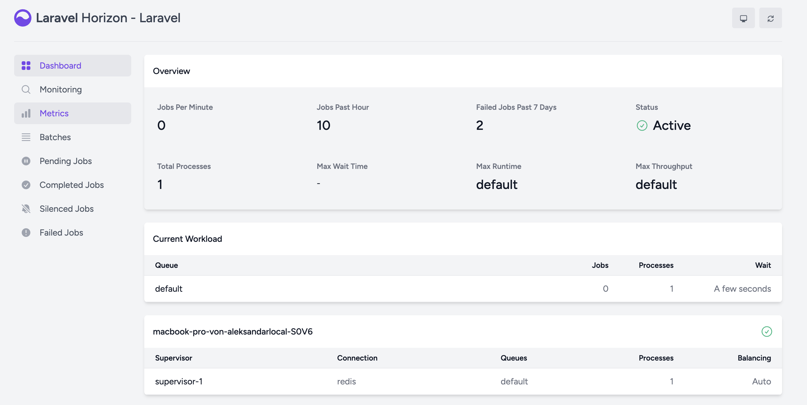
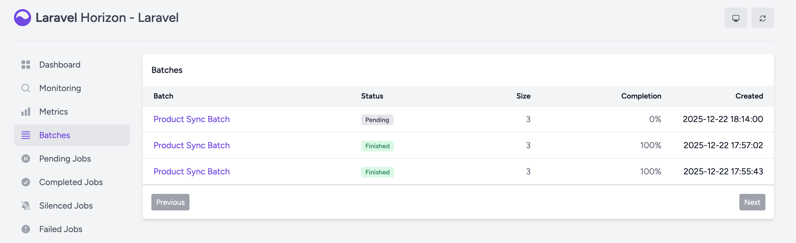

# Laravel Event-Driven Sync System (Redis + Horizon)

This repository showcases a **production-style event-driven backend architecture**
built with **Laravel**, **Redis queues**, and **Laravel Horizon**.

The project is an architectural showcase focused on background processing,
batch jobs, and observability. It is intentionally **not a full product**.

---

## What This Demonstrates

- Event-driven architecture
- CQRS-lite (Commands → Events → Jobs)
- Redis-backed queues
- Batch job processing
- Horizon monitoring and retries
- Clean separation of responsibilities

---

## Architecture Flow

HTTP / Command  
→ Domain Event  
→ Listener  
→ Batch Jobs (Redis Queue)  
→ Horizon Dashboard

---

## Example Use Case

**Product Synchronization**

Triggering a sync operation dispatches a domain event that creates a batch
of background jobs. Each job simulates synchronization of an external product
and is fully observable through Horizon.

---

## Running Locally

composer install  
php artisan migrate  
php artisan horizon  
php artisan serve  

Trigger sync:

POST /api/sync/products  
GET /trigger-sync

Local demo trigger:

GET /trigger-sync  

Horizon dashboard:

http://127.0.0.1:8000/horizon

---

## Monitoring & Observability

Laravel Horizon provides real-time insight into queue activity,
batch execution, retries, and failures.

### Horizon Dashboard

### Batch Jobs Overview

---

## Testing

Feature tests validate orchestration logic by faking the bus and asserting
that batch jobs are dispatched correctly, without relying on Redis or Horizon.

Run tests:

php artisan test

---

## CI/CD

This project uses GitHub Actions to automatically validate the codebase on
every push and pull request.

The pipeline installs dependencies, prepares the Laravel environment,
runs database migrations, and executes the test suite.
Redis is provided as a service for queue-related functionality,
while tests run deterministically using the sync queue driver.

---

## Release & Changelog

Release history and notable changes are documented in  
[CHANGELOG.md](CHANGELOG.md).

---

## License

All rights reserved.
